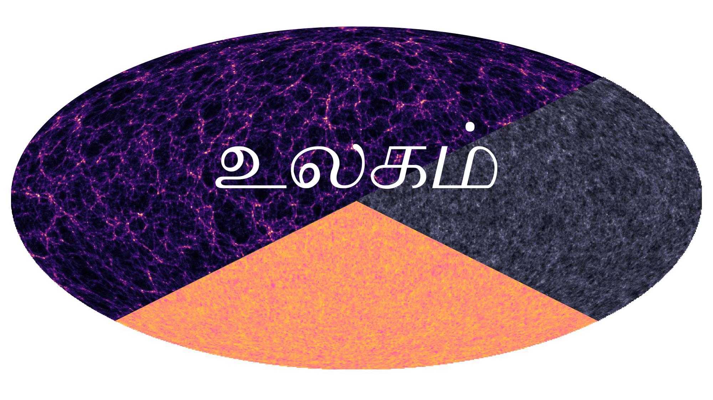

Ulagam simulations!
===================================

**Ulagam** is a N-body simulation suite designed for full-sky analyses of wide-field surveys. The simulations were run with the Pkdgrav3 code, in lightcone mode. The current public data products are the density fields at different redshifts of each sim. The suite contains ~4000 sims now. 2000 sims are run at fiducial cosmology, and another 1600 sims are for estimating derivatives with respect to different parameters. 

Check out the :doc:`data_products` section for what products are currently available, and the :doc:`access` section for how one can access these products. The :doc:`simulations` sections lists what sim runs are on the globus portals.

.. toctree::
   :maxdepth: 2
   :caption: Ulagam

   access
   data_products
   simulations
